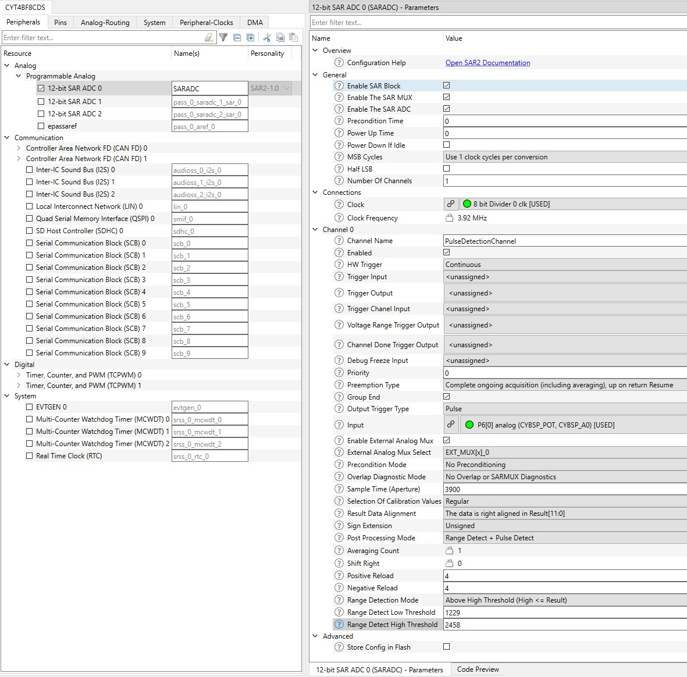
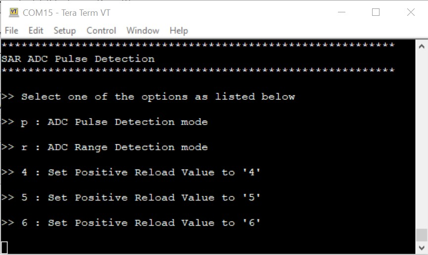
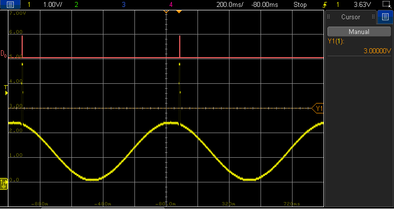
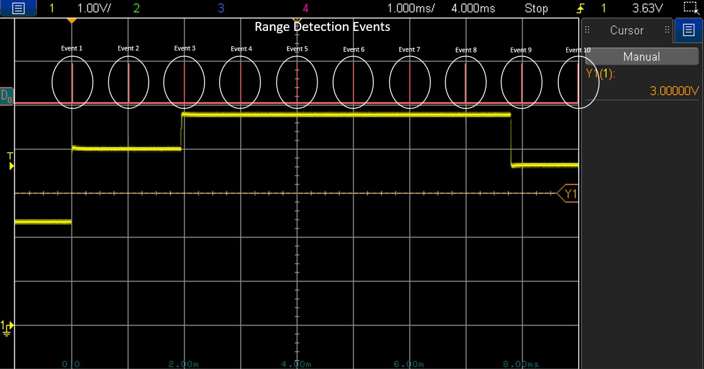
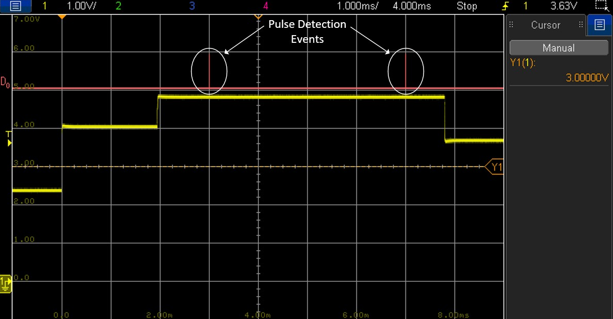
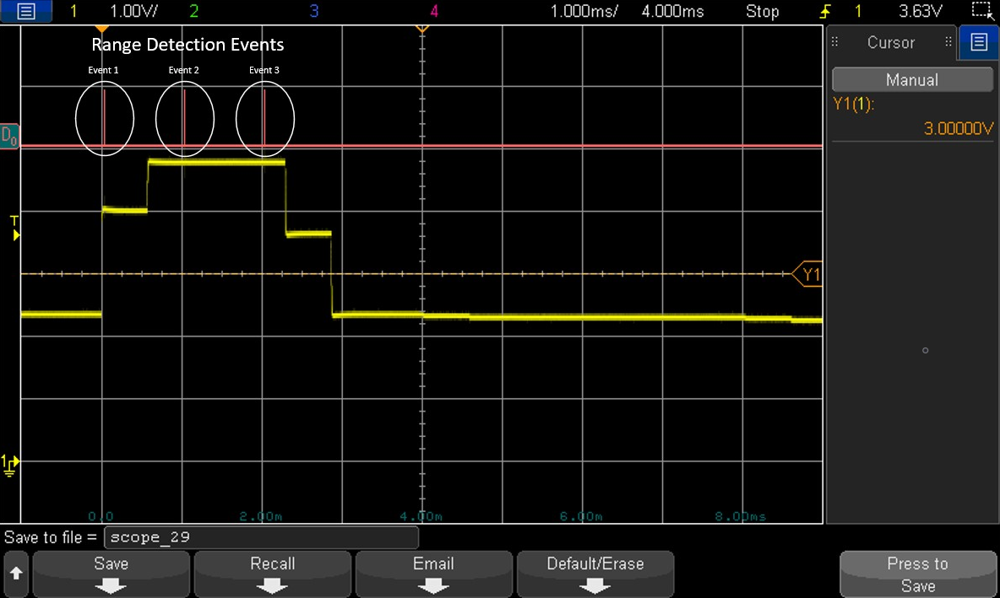
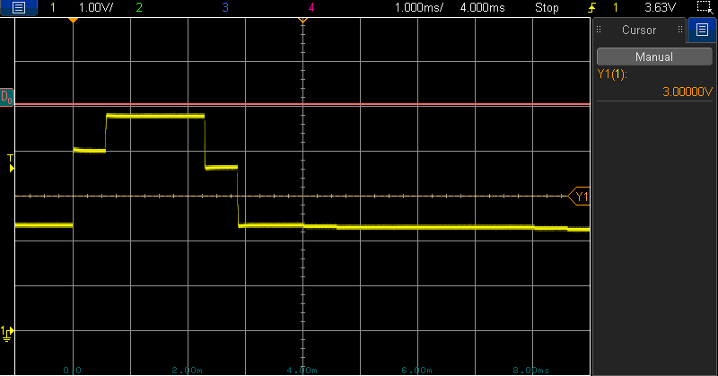
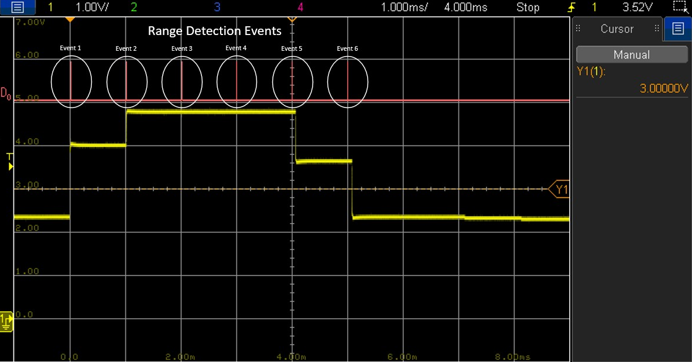
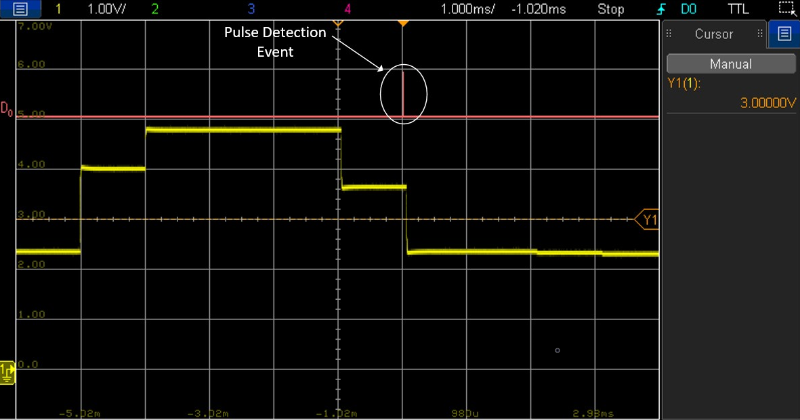

# ADC Pulse Detection

**This code example illustrates the functionality of the SAR ADC module's pulse detection feature. This feature relies on ADC range detection and serves the purpose of monitoring whether the converted ADC voltage result falls within the specified range while considering a filtering function.**  

## Device

The device used in this code example (CE) is:
- [TRAVEO™ T2G CYT4BF Series](https://www.infineon.com/cms/en/product/microcontroller/32-bit-traveo-t2g-arm-cortex-microcontroller/32-bit-traveo-t2g-arm-cortex-for-body/traveo-t2g-cyt4bf-series/)

## Board

The board used for testing is:
- TRAVEO™ T2G evaluation kit ([KIT_T2G-B-H_LITE](https://www.infineon.com/cms/en/product/evaluation-boards/kit_t2g-b-h_lite/))

## Scope of work

In this example, we configure the ADC pulse detection feature to trigger an interrupt whenever the ADC input voltage deviates beyond the threshold voltages set by the user. Unlike the standard ADC range detection mode, we incorporate a hardware reload counter to tally the range detection events. The interrupt callback function is executed only when a certain number of predefined events are detected.

To provide the input voltage level to the chosen ADC channel, we utilize an onboard potentiometer. Alternatively, an external waveform generator can be employed to supply an appropriate ADC input signal. Whenever the ADC input voltage deviates from the specified range for the predefined reload counter value, the configured GPIO pin gives a momentary *HIGH* signal.

The primary purpose of the pulse detection feature is to filter out glitches or noise from the observed analog signal, among other potential applications.

## Introduction  

**SAR ADC**  

TRAVEO™ T2G features a successive approximation register analog-to-digital converter (SAR ADC), The SAR ADC is designed for applications that require a moderate resolution and high data rate. It consists of the following blocks:
- SARADC Core
- SARMUX
- SAR sequencer
- Diagnostic reference
- Reference buffer

SARMUX is an analog multiplexer to connect the signal sources to the ADC input. The SARADC core then perform the analog-to-digital conversion. A SAR sequencer is responsible for prioritizing the trigger requests, enabling the appropriate analog channel, and controlling the sampling.

TRAVEO™ T2G platform supports the following ADC features:
- Three SAR A/D converters with up to 96 external channels
- Each ADC supports 12-bit resolution and sampling rates of up to 1 Msps
- Each ADC also supports six internal analog inputs like 
   - Bandgap reference to establish absolute voltage levels
   - Calibrated diode for junction temperature calculations
   - Two AMUXBUS inputs and two direct connections to monitor supply levels
- Each ADC has a sequencer supporting the autonomous scanning of configured channels
- Synchronized sampling of all ADCs for motor-sense applications

**ADC range and pulse detection**

The SAR sequencer provides support for an optional pulse detection feature. This feature operates as a sub-mode of range detection and allows for comparison against two programmable threshold values without requiring CPU involvement.

Range detection is defined by two 16-bit threshold values and a mode field selecting one of four possible modes. Both the mode *PASSx_SARy_CHz_POST_CTL.RANGE_MODE* and the two thresholds *PASSx_SARy_CHz_RANGE_CTL.RANGE_LO* and *PASSx_SARy_CHz_RANGE_CTL.RANGE_HI* are configured per channel. The available range detection modes are:
- *BELOW_LO* (RESULT < RANGE_LO) 
- *INSIDE_RANGE* (RANGE_LO ≤ RESULT < RANGE_HI)
- *ABOVE_HI* (RANGE_HI ≤ RESULT)
- *OUTSIDE_RANGE* (RESULT < RANGE_LO) || (RANGE_HI ≤ RESULT) 

Range detection uses the 16-bit *PASSx_SARy_CHz_RESULT.RESULT* from the "left/right align" step. This means that the threshold values need to be in the same format as the  *PASSx_SARy_CHz_RESULT.RESULT* after all the preceding post-processing steps (including averaging). The event flag will be set when the range mode condition evaluates to *true*.
                                                         
When the event flag is set, the *PASSx_SARy_CHz_INTR.CH_RANGE* interrupt will be set and a pulse is output on the range violation trigger.

The post-processing mode can be selected between the following options:
- *CY_SAR2_POST_PROCESSING_MODE_RANGE* (Range Detection)
- *CY_SAR2_POST_PROCESSING_MODE_RANGE_PULSE* (Range + Pulse Detection)

The configuration is done in the *PASSx_SARy_CHz_POST_CTL.POST_PROC* field of the configured ADC channel.

In pulse detection mode, a parameter called positive reload value has to be set. By setting the positive reload value to 4, four range detection events are required in pulse detection mode to trigger an interrupt. The timing and filtering behavior can be modified by choosing different positive reload values.

In this code example, the user can switch between both post-processing modes. 

More details can be found in [Technical Reference Manual (TRM)](https://www.infineon.com/dgdl/?fileId=5546d4627600a6bc017600bfae720007), [Registers TRM](https://www.infineon.com/dgdl/?fileId=5546d4627600a6bc017600be2aef0004) and [Data Sheet](https://www.infineon.com/dgdl/?fileId=5546d46275b79adb0175dc8387f93228).

## Hardware setup

This CE has been developed for:
- TRAVEO™ T2G evaluation kit lite ([KIT_T2G-B-H_LITE](https://www.infineon.com/cms/en/product/evaluation-boards/kit_t2g-b-h_lite/)) 
 
No changes are required from the board's default settings.

The onboard potentiometer *VR1* can be used to define a voltage level connected to an ADC input channel. Alternatively, a waveform generator can be connected to the same ADC input channel by using *pin 1* of Arduino *connector J15*. In that case ensure that the potentiometer is set to a middle position to avoid that the potentiometer output has GND or 5V potential.

When the voltage chosen by the user is out of range, an interrupt is triggered dependent on the chosen post-processing mode. The interrupt is indicated and can be measured on *pin 8* of *connector X2* using an oscilloscope.

Please refer to the board schematic for more details on how the potentiometer is connected to the ADC.

A UART serial connection should be made with the computer via the serial port (KitProg3 connector). Use a terminal emulator to see the output on the screen. In the terminal emulator settings, select the KitProg3 COM port and set the baud rate to 115200. 

## Implementation

In this design, an onboard potentiometer is used to provide input to the SAR ADC. The input voltage ranges from 0V to 5V. 

When the program starts, by default, the pulse detection mode with a positive reload value of 4 is configured. The main function displays the available options for the post-processing modes and positive reload values on the terminal program. The user can then enter the corresponding keys to make a selection.

When the voltage provided by the user is out of range, an interrupt is triggered dependent on the chosen post-processing mode. The interrupt occurence is indicated with a short positive pulse signal on *pin 8* of *connector X2* where it can be measured using an oscilloscope. This signal is also shared with the onboard *USER_LED*. However, it is difficult to visually observe the changes on the *USER_LED* as only a short pulse will be output.

**STDOUT/STDIN setting**

Initialization of the GPIO for UART is done in the <a href="https://infineon.github.io/retarget-io/html/group__group__board__libs.html#gaddff65f18135a8491811ee3886e69707"><i>cy_retarget_io_init()</i></a> function.
- Initializes the pin specified by *CYBSP_DEBUG_UART_TX* as UART TX and the pin specified by *CYBSP_DEBUG_UART_RX* as UART RX (these pins are connected to KitProg3 COM port)
- The serial port parameters are 8N1 and 115200 baud

**GPIO pin configuration**

The *CYBSP_USER_LED* is configured to output mode. The corresponding GPIO pin is momentarily set to *HIGH* when the voltage is out of range or when a pulse event is detected, dependent on the chosen post-processing mode. Thus, the active-low *USER_LED* will be momentarily turned OFF.

The *CYBSP_POT* port pin which is connected to the onboard potentiometer is configured as analog input and connected to the configured ADC channel.

**SAR ADC initialization**

SAR ADC instance and channel are configured by calling <a href="https://infineon.github.io/mtb-pdl-cat1/pdl_api_reference_manual/html/group__group__sar2__functions.html#gad6ddc69b82b06fda5952c5da00de35ed"><i>Cy_SAR2_Init()</i></a> with appropriate arguments using macros and configuration structure <a href="https://infineon.github.io/mtb-pdl-cat1/pdl_api_reference_manual/html/structcy__stc__sar2__config__t.html"><i>cy_stc_sar2_config_t</i></a> configured by Device Configurator:

*Figure 1. ADC configuration* 

The code example utilizes the range mode configuration to generate an event when the ADC conversion result surpasses the upper threshold value defined in the *PASSx_SARy_CHz_RANGE_CTL_RANGE_HI field*. In this example, the value is set to *2458*, leading to an upper threshold range voltage level of *3.0V*.

**User input**

Using UART serial communication, a list of actions is presented on the terminal emulator. The user can input the corresponding key to choose between post-processing modes, such as range detection or pulse detection. Additionally, various values for the positive reload counter used for the pulse detection timing can be selected.

**Code example main loop**

The endless loop of the code example in *main()* always checks whether a character has been received from the user via UART (terminal) using <a href="https://infineon.github.io/mtb-hal-cat1/html/group__group__hal__uart.html#ga89108b2d339dc9863ec660588e3a4a12"><i>cyhal_uart_getc()</i></a>. The user interface supports numeric values ranging from *4 - 6* and alphabetic characters *p* and *r*. Receiving any other key will display the user menu.

The received character serves as the parameter to determine the post-processing mode. The user has the flexibility to toggle between two modes: pulse and range detection. In the range detection mode, each range detection event triggers the activation of the configured GPIO output signal. Conversely, in the pulse detection mode, an interrupt is generated only when the number of range detection events matches the predefined positive reload value. This positive reload value can be adjusted within the range of 4 to 6 by entering the corresponding character from the user menu.

The chosen post-processing mode and the positive reload value are updated by calling the function *configureAdcPulseDetectionMode()*. In this function, the ADC is temporarily disabled by calling <a href="https://infineon.github.io/mtb-pdl-cat1/pdl_api_reference_manual/html/group__group__sar2__functions.html#ga3c9fe108014e660a2a2fdbfd51498641"><i>Cy_SAR2_Disable()</i></a>, then the fields *PASSx_SARy_CHz_POST_CTL_POST_PROC* and *PASSx_SARy_CHz_POST_CTL_AVG_CNT* are written by the PDL driver API <a href="https://infineon.github.io/mtb-pdl-cat1/pdl_api_reference_manual/html/group__group__sar2__functions.html#gad6ddc69b82b06fda5952c5da00de35ed"><i>Cy_SAR2_Init()</i></a> for the configured ADC instance and channel. The SAR ADC block is then re-enabled using the API <a href="https://infineon.github.io/mtb-pdl-cat1/pdl_api_reference_manual/html/group__group__sar2__functions.html#gae928dc6cfa80e6ee015be6aac6fc759e"><i>Cy_SAR2_Enable()</i></a>. Next, the *handleAdcIrq()* function is setup as an interrupt handler and the system and CPU interrupts are enabled by calling <a href="https://infineon.github.io/mtb-pdl-cat1/pdl_api_reference_manual/html/group__group__sysint__functions.html#gab2ff6820a898e9af3f780000054eea5d"><i>Cy_SysInt_Init()</i></a> and *NVIC_EnableIRQ()*. As a last step, the channel interrupt is configured for the selected post-processing mode using <a href="https://infineon.github.io/mtb-pdl-cat1/pdl_api_reference_manual/html/group__group__sar2__functions.html#gaec97a2bde0497f5e95deb60a5e9d081a"><i>Cy_SAR2_Channel_SetInterruptMask()</i></a>  and the A/D conversion is triggered by calling the API <a href="https://infineon.github.io/mtb-pdl-cat1/pdl_api_reference_manual/html/group__group__sar2__functions.html#ga07a7023e4f6db655204d25a21b036651"><i>Cy_SAR2_Channel_SoftwareTrigger()</i></a>. The ADC will be re-triggered by hardware in continuous mode.

**A/D conversion**

The ADC is configured in continuous mode, which means that, since it is triggered once the SAR ADC is retriggering the following conversions autonomously. The clock and conversion timing is set with parameters that every 1 millisecond a new ADC conversion is done.

Upon detecting an ADC range or pulse event, the interrupt callback function *handleAdcIrq()* is triggered, causing the GPIO port pin output to be first set to *HIGH*, and then to *LOW*. This effect can be measured on *pin 8* of *connector X2* using an oscilloscope.

## Run and Test

For this example, a terminal emulator is required for displaying outputs and to change settings during runtime. Install a terminal emulator if you do not have one. Instructions in this document use [Tera Term](https://ttssh2.osdn.jp/index.html.en).

After code compilation, perform the following steps for flashing the device:
1. Connect the board to your PC using the provided USB cable through the KitProg3 USB connector. 
2. Open a terminal program and select the KitProg3 COM port. Set the serial port parameters to 8N1 and 115200 baud.
3. Program the board using one of the following:
    - Select the code example project in the Project Explorer.
    - In the **Quick Panel**, scroll down, and click **[Project Name] Program (KitProg3_MiniProg4)**.
4. After programming, the code example starts automatically. Confirm that the messages are displayed on the UART terminal:

   *Figure 2. User menu* 
   
   A list of various options is displayed. The user can select an option by entering the corresponding character:
    - p: Switch to pulse detection mode
    - r: Switch to range detection mode
    - 4: Select positive reload value of 4
    - 5: Select positive reload value of 5
    - 6: Select positive reload value of 6
   
   In range detection mode, each event can be observed on the configured GPIO pin, allowing verification of event occurrences. In contrast, in pulse detection mode, it becomes evident that several events are being filtered.    

   By setting the positive reload value to 4, four range detection events are required in pulse detection mode to trigger an interrupt and indicate this with the configured GPIO pin. The timing behavior can be modified by choosing different positive reload values within the range of 4 to 6.

5. You can debug the example to step through the code. In the IDE, use the **[Project Name] Debug (KitProg3_MiniProg4)** configuration in the **Quick Panel**. For details, see the "Program and debug" section in the [Eclipse IDE for ModusToolbox™ software user guide](https://www.cypress.com/MTBEclipseIDEUserGuide).

**Note:** **(Only while debugging)** On the CM7 CPU, some code in *main()* may execute before the debugger halts at the beginning of *main()*. This means that some code executes twice: once before the debugger stops execution, and again after the debugger resets the program counter to the beginning of *main()*. See [KBA231071](https://community.cypress.com/docs/DOC-21143) to learn about this and for the workaround.

**Expected behavior**

To demonstrate various ADC range and pulse detection setups, different configurations are selected. Each test employs a modified sinusoidal signal that incorporates glitches to simulate a disturbed signal. For testing purposes, an arbitrary waveform generator is utilized to provide input with a waveform pattern as shown in <a href="./waveform.csv"><i>waveform.csv</i></a>.

*Figure 3. Sinusoidal signal with injected glitches* 

As an alternative, a similar test setup can be employed using the onboard potentiometer or any other waveform, such as a triangle waveform, to examine the delay when the pulse detection event occurs.
In all test scenarios, it is essential to take into account the configured ADC setup. Both the range and pulse events occur when the ADC input level exceeds 3V.
To facilitate a straightforward demonstration, the timing of each ADC conversion is currently set to 1 millisecond. However, for application-specific purposes, it may need to be adjusted accordingly.
Every oscilloscope screenshot is derived from *Figure 3*, but it provides a zoomed-in view specifically highlighting the injected glitch pulse.

- Test 1: Positive reload value set to 4. Glitch timing > 3ms

  In this scenario, a pulse detection event is displayed. Since the positive reload counter is set to 4, it necessitates four consecutive range detection events to trigger a pulse detection event.

  *Figure 4* illustrates the activation of range detection mode by pressing the *r* key in the user menu. When the signal is above 3V, each ADC conversion will indicate a range detection event.

  *Figure 4. Range detection mode (test 1)* 

  *Figure 5* depicts the same scenario, but in this case, the post-processing mode has been changed to pulse detection by pressing the *p* key in the user menu. As a result, only event *4* from the previous picture remains visible, while events *1* to *3* have been filtered out. Similarly, for the second pulse detection event, which aligns with event *8*, events *5* to *7* are also filtered out.

  *Figure 5. Pulse detection mode (test 1)* 

- Test 2: Positive reload value set to 4. Glitch timing < 3ms

  In contrast to test 1, this time the glitch timing is adjusted such that there are fewer than 4 range detection events. As illustrated in Figure 6, when the post-processing mode is set to range mode, only 3 events are observed.

  *Figure 6. Range detection mode (test 2)* 

  As a result, when switching to pulse detection mode, Figure 7 demonstrates that no pulse detection event is observed. The glitch is effectively filtered out.

  *Figure 7. Pulse detection mode (test 2)* 

- Test 3: Positive reload value set to 6. Glitch timing > 5ms
  
  By altering the positive reload value, the timing of the filtering can be adjusted. In this case, the positive reload value is now set to 6, which is different from the previous tests. *Figure 8* displays the outcome in range detection mode with a glitch timing exceeding 5 milliseconds.

  As a result, six range detection events can be observed.

  *Figure 8. Range detection mode (test 3)* 

  After switching to pulse detection post-processing mode, the first five range detection events are filtered out, and the sixth event corresponds to the pulse detection event.

  *Figure 9. Pulse detection mode (test 3)* 

## References

Relevant Application notes are:
- AN235305 - GETTING STARTED WITH TRAVEO™ T2G FAMILY MCUS IN MODUSTOOLBOX™
- [AN219755](https://www.infineon.com/dgdl/?fileId=8ac78c8c7cdc391c017d0d3aaebf676a) - USING A SAR ADC IN TRAVEO™ T2G AUTOMOTIVE MICROCONTROLLERS

ModusToolbox™ is available online:
- <https://www.infineon.com/modustoolbox>

Associated TRAVEO™ T2G MCUs can be found on:
- <https://www.infineon.com/cms/en/product/microcontroller/32-bit-traveo-t2g-arm-cortex-microcontroller/>

More code examples can be found on the GIT repository:
- [TRAVEO™ T2G Code examples](https://github.com/orgs/Infineon/repositories?q=mtb-t2g-&type=all&language=&sort=)

For additional training, visit our webpage:  
- [TRAVEO™ T2G training](https://www.infineon.com/cms/en/product/microcontroller/32-bit-traveo-t2g-arm-cortex-microcontroller/32-bit-traveo-t2g-arm-cortex-for-body/traveo-t2g-cyt4bf-series/#!trainings)

For questions and support, use the TRAVEO™ T2G Forum:  
- <https://community.infineon.com/t5/TRAVEO-T2G/bd-p/TraveoII>  
